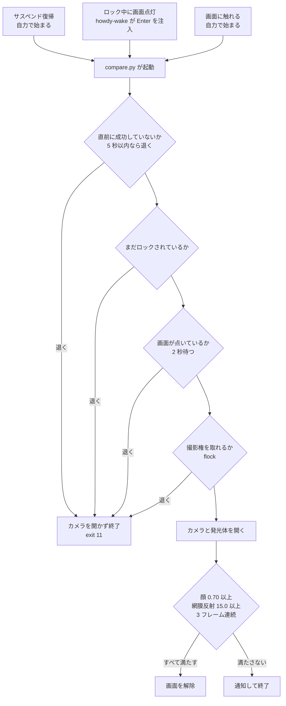

# 顔認証 (Windows Hello 相当)

IR カメラと赤外線照明が動いたので、画面ロックの解除に顔認証を使える。

**前提**: [../dkms/tps68470-irled](../dkms/tps68470-irled) と
[../ir-camera](../ir-camera) が先に動いていること。発光体なしでは実用にならない
（後述）。

## 全体像

以下は現在の実機の値。個々の判断の理由は後続の節にある。



### 適用範囲

| | |
|---|---|
| 使う | **画面ロックの解除のみ** |
| 使わない | `sudo`・ログイン・polkit（GUI の管理者認証） |
| PAM の置き場所 | `/etc/pam.d/kde-fingerprint`（非対話型の枠） |
| `/etc/pam.d/kde` | **無改変。** PIN の経路は構造的に安全 |

理由は「[PAM の置き場所](#pam-の置き場所)」と「[位置づけ](#位置づけ)」。

### 認証が始まるきっかけ

| きっかけ | 誰が認証を始めるか | `howdy-wake` の動き |
|---|---|---|
| サスペンド復帰 | `pam_howdy` が自力で開始 | 5 秒見届けて、始まっていれば注入しない |
| ロック中に画面点灯 | 誰も始めない | Enter を 1 回注入（空 PIN 相当） |
| 画面に触れる | グリーターが自力で開始 | 関与しない |

**常駐サービスは認証の判断に一切関与しない。** セッションを直接解錠する権限も
持たない。詳細は「[自動ロック後に顔認証が起動しない問題](#自動ロック後に顔認証が起動しない問題)」。

### 通す条件（3 つを同時に）

| 条件 | 値 | 何を見ているか |
|---|---|---|
| 顔の一致度 | `certainty = 0.70` | 登録した顔との距離 |
| 網膜反射 | `eye_reflection_threshold = 15.0` | **開眼と注視** |
| 連続一致 | `consecutive_matches = 3` | 外れ値で通らないこと |

顔が一致しても目を閉じていれば通らない。登録は **1 枚のみ**（増やすと他人の
一致度だけが上がる）。

### カメラを開く前のガード（4 つ）

PAM から起動されたときだけ働く。判定は `HOME` 環境変数の有無で、
**親プロセスの生死に依存しない。**

| 順 | ガード | 防ぐもの |
|---|---|---|
| 1 | 直前に成功していないか（5 秒） | 解除直後の二重起動 |
| 2 | まだロックされているか | 解錠済みでの起動 |
| 3 | 画面が点いているか（2 秒待つ） | サスペンド時の無意味な発光 |
| 4 | 撮影権を取れるか（flock） | 撮影中に別インスタンスが重なる |

**CLI 実行（`howdy test` など）はすべて素通りする。**

### 起動ロジックの再検討（2026-09-16）

上の起動ロジックをゼロから組み直し、現行実装と比較した記録が
[design-review-2026-09.md](design-review-2026-09.md) にある。
**結論: 契機（ロック中に画面が点いた）は正しい。始め方（Enter の注入）は
ロック画面 QML から直接 `startAuthenticating()` を呼ぶ形に置き換えられ、
リードタイムを 2.6 / 3.9 秒から約 1 / 2 秒に縮められる。** 段階的に進める
計画と、却下した案・再検討の条件を表にしてある。

### 起動ロジックの改良（第 0〜2 段、2026-09-16 実装・導入前）

再検討の最終案を実装した。**導入は机上レビューのあと。** 部品は 4 つ。

| 部品 | 置き場 | 何をするか |
|---|---|---|
| `resume_delay = 0` | `patches/04-config-defaults.patch` | 第 0 段。復帰後の 2〜3 秒の待ちをやめる。画面が点くまでの待ちは compare.py のガードが担う |
| `plasma-mobile/plasma-mobile-lockscreen-face-auth.patch` | plasma-mobile のローカルビルド（`~/開発・検証/plasma-mobile-window-patch/` に同じもの） | 第 1 段: `tryPassword()` は解錠済みなら `Qt.quit()` だけ（成功の取り消しを防ぐ）。第 2 段: `onDpmsTurnedOn` で非対話認証を再開。状態が `Idle` なら `startAuthenticating()`、`Authenticating`（最初の顔認証が時間切れのあと。状態は対話型の失敗でしか戻らない）なら対話型の会話を `cancel()` で打ち切り、その失敗が届いたところで黙って再開（「PIN が違います」は出さない。打ち切りは `PAM_CONV_ERR` で失敗遅延が付かない）。3 秒の絞り、PIN 判定中と失敗直後は呼ばない |
| `howdy-wake.py` の自己判別 | 同 | ロック画面 QML に目印 `chikara: face-auth-lockscreen v1` があれば注入しない。無ければ従来どおり注入。**パッチが外れても自動で戻る保険** |
| `patch-watch.{path,service,sh}` + `check-install.sh` | 同 | dpkg が動いたら点検し、崩れていれば通知。plasma-mobile の hold、目印、アーカイブの新版、設定の一致を見る |

**更新が当たっても締め出しはしない。** 素の QML に戻れば従来の挙動（howdy-wake が
注入）に戻るだけで、`/etc/pam.d/kde` と compare.py のガードは plasma-mobile と
無関係。詳細は [design-review-2026-09.md](design-review-2026-09.md) §5。

導入の順（レビュー後）:

```bash
cd "$HOME/開発・検証/camera"   # 以下は相対パス。ここから実行する
# 1. 更新保護（パッチと無関係に、既存の C++ パッチも守る）
sudo apt-mark hold plasma-mobile plasma-mobile-tweaks
# 2. 第 0 段
sudo install -m 644 -o root -g root ir-face/boy-howdy/howdy/src/config.ini /etc/howdy/config.ini
# 3. 保険と監視
sudo install -m 755 ir-face/src/howdy-wake.py /usr/local/bin/howdy-wake
systemctl --user restart howdy-wake.service
install -m 644 ir-face/src/patch-watch.path ir-face/src/patch-watch.service ~/.config/systemd/user/
systemctl --user daemon-reload && systemctl --user enable --now patch-watch.path
# 4. 第 1・2 段（約 22 分のビルド。導入前に Timeshift）
plasma-mobile-patch build && plasma-mobile-patch install   # → 再ログイン
```

### 固まったときの保険

クイック設定のタイルからロック画面を再起動できる。**同一ロックセッションでの
再起動は 1 回まで**で、2 回目は警告と強制再起動の案内を出す。`kscreenlocker` は
グリーターの異常終了を 3 回までしか許容せず、4 回目で TTY からしか復帰
できなくなるため。

## 採用したもの

**[Boy-Howdy](https://github.com/spp901780/Boy-Howdy)**。本家 Howdy の
PPA は 24.04 以降で壊れており、pip 経由の dlib 導入が Python 側の
ポリシー変更で失敗する。`python3-dlib` は Ubuntu のリポジトリにも無い。

Boy-Howdy は dlib をやめて OpenCV 内蔵の DNN（YuNet 検出 + SFace 認識）に
置き換えたフォーク。`python3-opencv` に両 API が入っているため
依存関係の問題が消える。YuNet は dlib の HOG より速く、非力な CPU に効く。

## 構成

| ファイル | 役割 |
|---|---|
| `patches/01-compare-eye-detection-and-notify.patch` | 開眼検出と失敗通知 |
| `patches/02-video-capture-ipu3-ir-plugin.patch` | IR リーダーの組み込み |
| `patches/03-build-add-reader-drop-gtk.patch` | ビルド設定 |
| `patches/04-config-defaults.patch` | 既定値 |
| `etc/pam.d-kde-fingerprint` | PAM 設定 |
| `etc/99-tps68470-irled.rules` | 発光体の権限 |
| `howdy-wake.py` | 画面点灯で認証を起こす常駐サービス |
| `howdy-wake.service` | 上の systemd ユーザーユニット |
| `lockscreen-restart.sh` | 固まったロック画面の復旧スイッチ |
| `quicksetting/` | 上を呼ぶクイック設定タイル（Plasma Mobile） |
| `plasma-mobile/plasma-mobile-lockscreen-face-auth.patch` | ロック画面が画面点灯で認証を起こし、成功を取り消さないようにする |
| `patch-watch.path` / `.service` / `.sh` | dpkg の動作後に導入点検と通知 |
| `irwatch.py` | 発光の常時記録（再現しない現象を追うため） |
| `irwatch.service` | 上の systemd ユーザーユニット |
| `impostor_test.py` | 他人受入率の測定 |
| `check-install.sh` | 導入状態の点検（更新のあとに実行する） |

リーダー本体は [../ir-camera/ipu3_ir_reader.py](../ir-camera/ipu3_ir_reader.py)。
`howdy/src/recorders/` に置く。

`howdy-wake` は Plasma が自動ロック後に認証を開始しない問題への対処。
詳細は「[自動ロック後に顔認証が起動しない問題](#自動ロック後に顔認証が起動しない問題)」の節。

## PAM の置き場所

**`/etc/pam.d/kde` ではなく `/etc/pam.d/kde-fingerprint`。**

Plasma 6 の画面ロッカーは3つの PAM サービスを使う。

| サービス | 役割 |
|---|---|
| `kde` | 対話型（パスワード / PIN） |
| **`kde-fingerprint`** | **非対話型。ここに顔認証を置く** |
| `kde-smartcard` | 非対話型 |

非対話型の枠は PIN 入力とは別ハンドルで並行実行される。
`kde` に置くと PAM の会話を奪い合い、**正しい PIN が「誤り」と判定されて
GUI から出られなくなる**。実際に三度そうなった。

`kde-fingerprint` なら `/etc/pam.d/kde` に一切触れないので、
PIN の経路は構造的に壊れない。

⚠️ **`[success=end ...]` は不正な記法。** PAM の動作に `end` は存在しない
（有効なのは `ignore` `bad` `die` `ok` `done` `reset` と数値）。
Boy-Howdy の `pam-configs`（`pam-auth-update` 用のプロファイル形式）の記述を
`/etc/pam.d/` の生の記法に流用すると壊れる。`sufficient` を使うこと。

syslog に `PAM pam_parse: expecting jump number` が出ていれば、これ。

## 検証の注意

**`sudo pamtester` で検証してはいけない。**
`kscreenlocker_greet` は setuid ではなく**一般ユーザー権限**で動く。
`sudo` を付けると root で通ってしまい、本番の条件をまったく再現しない。

```bash
# 正しい検証（sudo なし）
pamtester kde-fingerprint "$USER" authenticate
```

また PAM は環境変数を絞る（`PATH=/usr/local/bin:/usr/bin:/bin`）。
`/usr/sbin` は含まれないので、そこにあるコマンドは絶対パスで呼ぶこと。

## 開眼・注視の検出

**顔認証は「本人が寝ているか起きているか」を原理的に区別できない。** 同じ顔だから。

実測（登録1枚、正しい露出）:

| 条件 | 一致度 平均 | 最小 | 最大 |
|---|---|---|---|
| 正面 | 0.896 | 0.875 | 0.912 |
| **目を閉じる** | **0.791** | 0.766 | **0.815** |
| 目を細める | 0.802 | 0.750 | 0.830 |
| 口元を覆う | 0.755 | 0.694 | 0.803 |

**閾値をどこに置いても閉眼を分離できない。** 就寝中に端末を顔へ向けられれば
解除される。

### 網膜反射を使う

赤外線が瞳孔から入り網膜で反射してカメラへ戻る（bright pupil effect）。
**発光体がカメラと同軸にあるため明瞭に出る。**
目を開けてカメラを見ているときにだけ現れる。

| 条件 | 平均 | 最小 | 最大 | 閾値15超 |
|---|---|---|---|---|
| **目を開けて注視** | **30.6** | **21.0** | 35.0 | **100%** |
| 目を閉じる | 0.0 | 0.0 | 0.0 | **0%** |
| 目を細める | 0.0 | 0.0 | 0.0 | **0%** |
| 視線だけ外す | 6.0 | 0.0 | 34.0 | 11% |

**一致度では完全に重なる条件が、この指標では完全に分離する。**
Windows Hello の「注視の要求」に相当する。

⚠️ 実装上の注意: **顔が明るく照らされるため顔領域は容易に飽和する**
（75パーセンタイルが 255）。顔全体を基準にすると差が消えて常に 0 になる。
**目のパッチ内の局所コントラスト（最大値 − 中央値）**で見ること。

## 登録は増やさない

直感に反するが、**登録を増やすと安全性が下がる。**

| | 1枚 | 4枚 |
|---|---|---|
| 本人・正面（最小） | 0.771 | 0.774 |
| 目を閉じる（最大） | 0.647 | **0.726** |
| 差 | 0.124 | **0.048** |

本人の値はほぼ変わらず、攻撃側だけが上がる。どれか1つのモデルに似ていれば
通る仕組みである以上、当然の帰結。

**ただしこの表の「攻撃」は目を閉じた顔で、いまは網膜反射ゲートが全フレーム
遮断する。** 根拠としては失効している。それでも結論は変わらない。
反射ゲートが保証するのは「生きていて注視している」ことだけで、
**顔立ちの近い実在の他人には無力**だからである。

### 代わりに、登録する距離を選ぶ

**1 枚で足りる。増やすより置き場所を選ぶほうが効く。**

登録を近距離で行うと遠距離で通らない。逆も同じ。広角レンズでは近距離ほど
遠近歪みが強く、登録時と使用時で顔の形が変わるため。

**近距離と遠距離の中間で 1 枚登録すると全域をカバーできた。**

| 登録距離 | 近で解除 | 中で解除 | 遠で解除 |
|---|---|---|---|
| 近距離で登録 | 0.91 | - | **0.59（失敗）** |
| 中間距離で登録 | 0.87 | 0.92 | 0.87 |

## 設定

`/etc/howdy/config.ini` の `[video]`:

```ini
certainty = 0.70
require_open_eyes = true
eye_reflection_threshold = 15.0
consecutive_matches = 3
recording_plugin = ipu3_ir
timeout = 5
max_height = 480
detection_threshold = 0.7
```

`timeout = 2` は短すぎる。認証は固定コスト約 880ms（Python 起動 420ms /
カメラ 185ms / モデル 137ms / 照合 140ms）に、顔が取れるまでのフレーム数ぶん
約 60ms/フレームが乗る。正面を向いていれば 1 フレーム目で通るが、
視線が外れていると網膜反射ゲートで弾かれ続けるので余裕を持たせる。

## 1 フレームで解除しない

**`consecutive_matches` で、連続して一致したフレーム数を要求する。** 既定 3。

1 フレームでも通れば解除する方式は、実質「最大値を採る」処理になる。
`timeout = 5` では 1 回の試行で 80〜250 フレームを評価するので、
**閾値付近の他人にとっては、外れ値を引くまでくじを引ける**ことになる。
しかも PAM に `faillock` の類が入っていなければ試行回数の制限も無く、
画面を点け直せば何度でも引き直せる。

連続性はフレーム番号で見る。黒フレーム・暗すぎ・顔なしで捨てられた回は
番号が飛ぶので、判定を書き換えずに自然と途切れる。

**本人への影響はほとんど無い。** 正面を向いていれば毎フレーム安定して
閾値を超えるため、増えるのは数十 ms（実測 0.97 秒 → 1.29 秒）。
他人が 1 フレーム通る確率を p とすると、要求が 3 連続になることで p³ になる。

これは試行回数の制限そのものではない。画面を点け直せば新しい試行はできる。
**1 回の試行あたりのくじの本数を減らすもの**と考えるのが正しい。

## 点灯までの時間の内訳

**ガードの順序を変えても速くならない。** 4 つは AND 条件で、成功する経路では
必ず全部が実行される。順序が決めるのは「却下されるとき、どれが最初に弾くか」
だけ。

プロセス起動から発光までの実測は 712 / 814 / 842 ms。

| 区間 | 時間 | 割合 |
|---|---|---|
| Python の起動 | 38 ms | 5% |
| **`import cv2`** | **407 ms** | **50%** |
| numpy・video_capture ほか | 12 ms | 1% |
| 設定読み・モデル読み込み開始 | 約 50 ms | 6% |
| **ガード 4 つ** | **10 ms** | **1.3%** |
| カメラを開く（v4l2 設定 → 点灯） | 約 250 ms | 31% |

ガードの内訳。

| ガード | 実測（中央値） |
|---|---|
| 1 直前の成功 | 0.04 ms |
| 2 ロック状態（`qdbus6` を起動） | 9.86 ms |
| 3 画面の状態 | 0.31 ms |
| 4 撮影権（flock） | 0.01 ms |

**全部消しても 1.3%。** モデルの読み込みは既にデーモンスレッドでカメラ起動と
並行しており、隠れている。

### 短縮しようとして、やめたこと

| 手立て | 効果 | やめた理由 |
|---|---|---|
| ガード 2 を Python の D-Bus に置換 | **マイナス** | `import dbus` が 38.9 ms。置き換える対象は 9.9 ms |
| ガードを `import cv2` より前へ | 点灯は **0 ms** | 却下時に約 450 ms 節約できるが、体感は変わらない |
| カメラを開くのを import より前へ | 最大 400 ms | 下記 |
| cv2 を先読みした常駐プロセス | 400 ms | 撮影権の排他と衝突し、PAM から呼ぶ設計を根本から変える |

**カメラを先に開く案が最も危ない。** 400 ms 早く光らせても、その間フレームを
取っていないので認証は 1 ms も早くならず、露出の収束も進まない。そして
**「撮影しているときだけ光る」という前提が壊れ**、ガードが弾く場合にも
光ってしまう。「[画面が消えているときはカメラを開かない](#画面が消えているときはカメラを開かない)」
で潰した無駄な発光が、別の形で戻る。

## 失敗時の通知

理由で出し分ける。

| 状況 | 通知 |
|---|---|
| 顔は一致したが目が閉じていた | 「カメラを見てください」 |
| 顔は見えたが一致しなかった | 「顔を認識できませんでした」 |
| 顔が見つからなかった | **通知しない** |

最後のケースで通知しないのは、最初から PIN で解除するつもりのときに
邪魔になるため。

**一致度の数値は通知に出さない。** 顔の似た他人が繰り返し試して
「あとどれだけ足りないか」を知る手がかりになる。

PAM 経由では環境変数が絞られるため、`notify-send` を呼ぶ際は
`DBUS_SESSION_BUS_ADDRESS=unix:path=/run/user/$UID/bus` を明示する。

## 自動ロック後に顔認証が起動しない問題

**Plasma のロック画面は、放置による自動ロックでは認証を開始しない。**
グリーターは生成されるが、利用者が画面に触れるまで PAM の会話が始まらない。
サスペンド復帰では操作なしで始まる（実測25回）ので、契機によって
挙動が違う。実測:

```
20:42:30  グリーター生成
20:42:32  ロック成立
20:43:32  画面消灯
20:45:24  画面点灯          ← ここでも認証は始まらない
20:45:45  触った瞬間に認証開始（3分15秒後）
```

### 対処: 画面点灯を検知する常駐サービス

`howdy-wake.py` + `howdy-wake.service`（systemd ユーザーユニット）。
画面が消灯から点灯へ変わり、かつロック中なら、`/dev/uinput` 経由で
Enter を1回注入する。「空の PIN を送信した」のと同じ刺激になり、
グリーターが認証を開始する。

**作るのは常駐サービスだけ。認証経路（PAM / pam_howdy / compare.py）は
無改変** ……ではなく、副作用を塞ぐガードだけ compare.py に追加してある
（後述）。認証の判断そのものには一切関与しない。

```bash
sudo install -m 755 howdy-wake.py /usr/local/bin/howdy-wake
mkdir -p ~/.config/systemd/user
install -m 644 howdy-wake.service ~/.config/systemd/user/
systemctl --user daemon-reload
systemctl --user enable --now howdy-wake.service
```

**Enter でなければ効かない。** shift・space・esc・タッチ（スワイプ／タップ）は
すべて無反応だった（実測）。UI が開くことと認証が始まることは別で、
空 PIN の送信だけが引き金になっている。

**常駐サービスがセッションを直接解錠することはできない。**
`org.freedesktop.login1.lock-sessions` は `allow_active=auth_admin_keep`
（管理者認証が必要）。認証の判断は PAM に残る。このサービスは
「触った」のと同じ刺激を与えるだけ。

グリーターを殺して作り直させる既知の回避策は採らなかった。
kscreenlocker は異常終了を3回までしか許容せず（解除するまでカウンタが
リセットされない）、4回目で `EmergencyWindow` に落ちて TTY からしか
復帰できなくなる。カバンの中での誤操作を考えると採れない。今回の方式に
回数の上限は無い。

### 副作用: 解除直後にもう一度発光体が光る

空 PIN の送信は対話型の認証を1回失敗させる。この失敗が
`graceLockTimer`（3秒）を動かし、認証をやり直させる。1回目の成功が
それより後だと、解除処理と並行して2回目がカメラを開いてしまう。

`compare.py` に、PAM から起動されたときだけ働くガードを足した。
現在は 4 つある（一覧は「[カメラを開く前のガード](#カメラを開く前のガード4-つ)」）。
このうち解除直後の二重起動を止めるのは次の 2 つ。

| ガード | 防ぐもの |
|---|---|
| 直前に成功していれば退く（5 秒） | 解除直後に 2 回目が起動する現象 |
| flock による排他 | 1 回目が撮影中に 2 回目が重なる現象 |

**「PAM から起動されたか」の判定に親プロセスを使ってはいけない。**
かつてそうしていて破綻した。理由は
「[PAM から起動されたかは、親プロセスで判定してはいけない](#pam-から起動されたかは親プロセスで判定してはいけない)」。

いずれのガードも CLI 実行（`howdy test` など）には影響しない。

### 危険: 成功が失敗遅延の窓に落ちると解錠できなくなる

**これが原因で一度、強制再起動が必要な状態になった（2026-09-05）。**

⚠️ **機序の説明を 2026-09-16 に訂正した。** 以下で挙げる Bug 515299 の修正は
事故の時点で既に入っていた（Ubuntu の 6.6.5 パッケージは自前の backport を
落としている）。ソースを追った結果、関与しているのは
**`PamAuthenticator::tryUnlock()` が無条件に `m_unlocked = false` にすること**と、
**成功の 1〜3 ms 後にロック画面が空 PIN を `tryPassword()` で送ること**
（10 日間の成功 194 件中 48 件）の組み合わせで、グリーターが
「Greeter tried to quit without being unlocked」を出して終了を拒む。
実測の相関（対話型失敗の 2.3 秒後に成功すると固まる）と対処
（`MIN_SUCCESS_DELAY`）は有効。詳細は
[design-review-2026-09.md](design-review-2026-09.md) の C6。

kscreenlocker は認証が失敗すると「次に認証を受け付ける時刻」を記録し、
それ以前に届いた認証を**黙って破棄する**（[KDE Bug 515299](https://bugs.kde.org/show_bug.cgi?id=515299)）。

```cpp
// greeter/pamauthenticator.cpp
void PamWorker::startFailedDelay(uint useconds) {
    m_nextAttemptAllowedTime = now() + microseconds(useconds);
}
void PamWorker::authenticate() {
    if (m_inAuthenticate || m_unavailable) return;
    else if (now() < m_nextAttemptAllowedTime) {
        qCCritical(... "Authentication attempt too soon. This shouldn't happen!");
        return;                       // 早期リターン
    }
```

Enter の注入は空 PIN の送信なので、対話型の認証が必ず 1 回失敗する。
**顔認証の成功がこの窓に落ちると解除されず、グリーターは「成功した」と
信じて終了しようとするが拒否され、操作も終了もできなくなる。**

    09:39:44.014  pam_unix(kde:auth) 失敗 → 失敗遅延が始まる
    09:39:46.285  Login approved（2.271 秒後）
    09:39:46.327  [PAM worker kde] Authentication attempt too soon
    09:39:46.339  Greeter tried to quit without being unlocked
    （以降 8 分間操作を受け付けず、強制再起動）

`kde` サービスの失敗遅延を実測すると **2236 / 2240 / 2334 / 2338 / 2343 ms**。
事故時の 2.271 秒はこの範囲のど真ん中だった。無事だった 20 件以上は
すべて 3.945 秒以降で、通常は 1 回目が失敗して `graceLockTimer` の 3 秒後に
成功するため約 4.2 秒かかる。**顔認証が速く成功するほど危ない。**

#### 対処: 注入があったときだけ成功の報告を遅らせる

`howdy-wake` は Enter を送った時刻を `/run/user/UID/howdy-wake-injected` に
残す。`compare.py` はこれが 15 秒以内のときだけ、起動から
`MIN_SUCCESS_DELAY`（3.5 秒）経つまで成功を報告しない。

    起動から 3.5 秒 → 対話型失敗からは 3.37 秒（起動は失敗の 0.13 秒前）
    実測上限 2.343 秒に対する余裕 +1.03 秒
    理論上限 2.5 秒に対する余裕   +0.87 秒

**普段の解除は遅くならない。** 通常は既に 4.2 秒かかっているため。
**サスペンド復帰も遅くならない。** 注入も失敗遅延も無いので印が付かない。

#### 復旧: クイック設定のタイル

固まっても、上からスワイプするクイックメニューは操作できた。そこから
グリーターを再起動するタイルを置く。`quicksetting/` と
`lockscreen-restart.sh`。

```bash
sudo install -m 755 lockscreen-restart.sh /usr/local/bin/lockscreen-restart
mkdir -p ~/.local/share/plasma/quicksettings/org.kde.plasma.quicksetting.lockerrestart
cp -r quicksetting/* ~/.local/share/plasma/quicksettings/org.kde.plasma.quicksetting.lockerrestart/
kwriteconfig6 --file plasmamobilerc --group QuickSettings --key enabledQuickSettings \
  "$(kreadconfig6 --file plasmamobilerc --group QuickSettings --key enabledQuickSettings),org.kde.plasma.quicksetting.lockerrestart"
```

**plasmashell を再起動してはいけない。** 設定は監視されており自動で反映される。
再起動を挟んだところ、終了処理中に plasmashell が SIGSEGV で落ちた。

**1 ロックにつき 1 回だけ許可する。** kscreenlocker は異常終了を 3 回までしか
許容せず、4 回目で TTY からしか復帰できなくなる。カウンタは解錠でしか
戻らない。同一ロックかどうかは `GetActiveTime`（ロックからの経過秒）を
現在時刻から引いた開始時刻で判定する。グリーターを作り直しても継続する値なので、
再起動を挟んでも同じロックだと分かる。2 回目は警告だけ出して強制再起動を促す。

⚠️ **スクリプトで `LC_ALL=C` を使ってはいけない。** 日本語を渡した
`notify-send` が `Invalid byte sequence in conversion input` で失敗し、
警告が一切出なくなる。`C.UTF-8` を使う。

### 復帰で「自力で始まる」の正体

復帰時に操作なしで認証が始まるのは、**サスペンドで出力が外れて付け直され、
グリーターが画面ごとに QML を読み直す**（`UnlockApp::handleScreen()` →
`Component.onCompleted` → `startAuthenticating()`）ため。10 日間の
「自力で始まった」40 件のうち 38 件で QML 生成の痕跡がある。DPMS だけの
点灯では出力が付け直されないので始まらない。これが常駐サービスの
存在理由の正確な説明。

### 復帰直後は注入しない

**サスペンドから復帰する経路では、こちらが何もしなくても認証が始まる。**
そこへ Enter を注入すると対話型の認証が余計に 1 回失敗し、認証が二重に走る。

かつてここを「理論上の隙間、実際には発生しない」と書いていたが、**発生した**
（2026-09-06）。5 時間のサスペンド中は画面が消えているので、復帰時の点灯が
そのまま「消灯 → 点灯」に見える。

    07:49:17.724  PM: suspend exit
    07:49:18.336  System resumed... waiting 2s   ← 自力で開始している
    07:49:20.261  howdy-wake が発火              ← 不要な注入
    07:49:22-26   1 回目の点灯
    07:49:29.299  Login approved
    07:49:30-31   2 回目の点灯（グリーターは既に消滅）

**ただし「復帰したから注入しない」では駄目だった。** 自力で始まるのは
グリーターが復帰後に作られたときだけで、既にプロンプトを出したグリーターが
残っていると復帰しても始まらない。実測（2026-09-06）:

| 時刻 | 復帰後にグリーターが新規か | 自力で始まったか |
|---|---|---|
| 08:00 | はい（新規ロック） | はい（0.1 秒後） |
| 12:52 | いいえ（11:49 から継続） | **いいえ** |
| 17:30 | いいえ | **いいえ** |
| 18:18:05 | いいえ | **いいえ** |
| 18:18:23 | いいえ | **いいえ** |

時間だけで決めた最初の版は 5 件中 4 件で誤って抑止し、認証が始まらないまま
放置された。12:52 では画面に触れるまで 10 秒間なにも起きていない。

**予測をやめ、実際に始まるかを数秒見届けてから決める。** `/run/howdy-resume-timestamp`
が新しければ、発光体か compare.py が現れるのを 5 秒待つ。現れれば注入しない。
現れなければ注入する。復帰経路は表示を待ってから撮影に入るので、点灯から
発光まで実測 2.0〜2.7 秒。5 秒あれば足りる。

### 画面が消えているときはカメラを開かない

**電源ボタンでサスペンドすると、無意味な発光が 1 回起きる。** ロックが
成立してグリーターが生成され、それが即座に認証を開始するが、画面は既に
消えている。誰も見ていないカメラを 5 秒回して発光体を光らせても意味がない。
実測（2026-09-06）:

    18:30:19.289  電源ボタン押下
    18:30:20.526  グリーター生成
    18:30:21.47   画面消灯
    18:30:22.331  発光（無意味）
    18:30:27.764  消灯。5.4 秒を捨てた

compare.py のガードに、画面が点いているかを足す。復帰の経路では pam_howdy
が "waiting 1-2s for display" と表示を待ってから呼ぶので、ここに来た時点で
既に点いている（実測 08:00、12:53）。それでも取りこぼさないよう、即断せず
2 秒だけ待つ。判定できない環境では従来どおり動かす。

### 顔認証と無関係な落とし穴: サスペンドが 24 秒遅れる

ロック画面の挙動が不安定に見えたが、**原因は顔認証ではなく sleep の
遅延抑止（delay inhibitor）だった。** 電源ボタンを押してから実際に
サスペンドするまで 24 秒かかり、その間にロック画面が出て認証が走り、
利用者が解除しようとしている最中にサスペンドが発動する。

    要求 00:07:22 → 開始 00:07:23   1.0 秒
    要求 11:59:11 → 開始 11:59:12   0.2 秒
    要求 17:29:41 → 開始 17:30:10  29.1 秒   ← ここから遅い
    要求 18:18:10 → 開始 18:18:34  24.1 秒
    要求 18:30:19 → 開始 18:30:43  23.8 秒

`InhibitDelayMaxSec=30`（unattended-upgrades が
`/usr/lib/systemd/logind.conf.d/` に置いている）まで待たされている。
つまり抑止を握ったまま離さないプロセスがいる。

    systemd-inhibit --list

で `WHAT=sleep MODE=delay` の行を見る。**18:18:10 の要求は顔認証が一切
動いていないのに 24.1 秒かかっており、顔認証は原因ではない。**

### プロセスの検出に部分一致を使わない

`/proc/*/cmdline` を 1 本の文字列として `"howdy/compare.py" in cmd` で
判定してはいけない。**シェルの `-c` は長いコマンド全体を argv 1 個として
持つため、その語を含むだけの診断コマンドに一致する。** この計画では
`pgrep -f` の自己一致で繰り返し誤検出しており、irwatch の記録も一度
誤らせた（2026-09-06 07:53 の「compare.py が 3 個」は観測用スクリプト自身）。

argv を NUL で分割し、**要素が丸ごとパスであること**を求める。空白を含む
要素は除く。

### PAM から起動されたかは、親プロセスで判定してはいけない

compare.py のガードは「PAM（ロック画面）から起動されたときだけ働く」。
その判定に**親プロセスの名前を使ってはいけない。**

グリーターは認証が成功すると `Qt.quit()` で終了する。2 回目の compare.py が
Python を起動している最中（cv2/numpy の読み込みだけで数百 ms）に親が消え、
systemd に引き取られる。**ファイルの先頭で固定しても、インタプリタの起動中に
親が死ねば手遅れ。** 上の事故では判定が False になり、ガードが 3 つとも
素通りした。

    07:49:29.299  Login approved（1 回目が成功）
    07:49:30.242  2 回目が点灯。このときグリーターは既に消滅

**環境変数で判定する。** pam_howdy は子に `PYTHONPATH` と `PATH` だけを渡す
（main.cc の envp）。`HOME` が無いことは exec の時点で決まり、あとから
変わらない。親の生死に左右されない。

```python
_LAUNCHED_BY_PAM = "HOME" not in os.environ
```

### 再現しない現象を追うための観測

`irwatch.py` + `irwatch.service`。発光体の brightness を 100ms ごとに読み、
点灯した瞬間だけを、そのとき動いていた compare.py・グリーター・印の鮮度と
ともに記録する。上の事故はこれで捕まえた。

```bash
sudo install -m 755 irwatch.py /usr/local/bin/irwatch
install -m 644 irwatch.service ~/.config/systemd/user/
systemctl --user daemon-reload && systemctl --user enable --now irwatch.service
tail -30 ~/.local/state/irwatch.log
```

⚠️ **観測が系を乱さないようにすること。** 最初に書いた観測スクリプトは
/proc の全エントリに対して `tr` を起動しており、毎秒数千プロセスを生成して
PID が 40 万進んだ。原因調査の道具が別の異常を作っては本末転倒。
irwatch は外部プロセスを一切起動せず、10 秒あたりの PID 消費は
システムの通常値と同程度に収まっている。

### 画面消灯＝ロックにする場合

`kscreenlockerrc` の `Timeout`（分）と `TurnOffDisplayIdleTimeoutSec`
（秒）を揃えるだけでよい。前後関係の調整は不要。発火条件は
「消灯→点灯」かつ「ロック中」で、どちらが先に成立しても、利用者が
画面を点ける時点では両方揃っている。

`LockGrace`（既定5秒）には注意。ロック直後は操作するだけで認証なしに
解除される。消灯とロックを揃えると「消えた直後に点けたら素通り」に
なるので、気になるなら 0 にする。

## システム更新との関係

**この構成はパッケージ管理の外にある。** howdy は meson から直接
インストールされており、`dpkg -S` でどのパッケージにも属さない。
apt のリポジトリにも howdy は存在しない。したがって **Discover や
apt が上書きすることは無い。**

PAM 設定も安全側にある。最近の PAM はベンダー用とローカル用を分けており、

    /usr/lib/pam.d/kde              ← パッケージが配布する（更新される）
    /usr/lib/pam.d/kde-fingerprint  ← 同上
    /etc/pam.d/kde-fingerprint      ← こちらが優先される。dpkg は書かない

`/etc/pam.d/` にはパッケージが書き込まないので、構造的に保護されている。

### 実際に壊れるのは DKMS 側

カーネル更新では DKMS モジュールが再ビルドされる。ビルド自体は自動だが、
**読み込みの順序で失敗しうる**（詳細は
[../dkms/tps68470-irled/README.txt](../dkms/tps68470-irled/README.txt)）。
症状は「認証は起動するが発光体が点かず失敗する」で分かりにくい。

### 更新のあとは点検する

```bash
./check-install.sh
```

改変したファイルの一致、PAM、設定、DKMS、udev、常駐サービスをまとめて見る。
問題があれば終了コード 1 と、戻すためのコマンドを出す。

`/etc/pam.d/kde` に有効な `pam_howdy` の行が復活していないかも確認する。
そこに置くと PIN と会話を奪い合い、**正しい PIN が「誤り」と判定されて
GUI から出られなくなる**（三度そうなった）。

boy-howdy のソースツリーが手元に無い場合、ファイル比較の項目は飛ばす。
比較したいときは `REPO=/path/to/camera ./check-install.sh` とする。

## 他人受入率の測定

`impostor_test.py` で測る。本人と協力者を**同一セッション**で、
近・中・遠の 3 距離で測り、compare.py と同じ条件
（類似度と網膜反射の両方）で判定する。

```
./impostor_test.py <本人のユーザ名> --log results.txt
./impostor_test.py <本人のユーザ名> --rehearsal    # 本人が両役で動作確認
```

**顔の画像も特徴量も保存しない。** 出力は統計値のみで、登録モデルと設定は
読むだけ。開始前に協力者向けの同意画面を出す。

### 実測（協力者 1 名）

| 距離 | 本人 最小 | 協力者 最大 | 差 | 受入 |
|---|---|---|---|---|
| 近 | 0.865 | 0.301 | 0.564 | 0 / 30 |
| 中 | 0.887 | 0.339 | 0.548 | 0 / 30 |
| 遠 | 0.802 | 0.296 | 0.506 | 0 / 30 |

閾値 0.70 に対し、本人まで +0.10、協力者まで -0.36。

### 測るときの注意

**必ず 1 人ずつ画角に入る。** 協力者側は検出した全ての顔の最大値を採るので、
別の顔が写り込むと値が汚れる。**分母が `--frames` と一致しなければ
顔が複数写っている。** 最初の測定でこれを踏み、協力者の最大値を
0.630 と誤って記録した（実際は 0.301）。

**AE が安定してから測る。** 収束前は類似度が実力より低く出る。
既定で先頭 25 フレームを捨てる（`--warmup`）。

**発光体は測定の合間に消える。** TPS68470 の WLEDTO によるハードウェア
タイムアウトで約 14 秒。認証本体は 1 秒未満なので実運用では起きないが、
対話的なツールでは必ず踏む。各測定の前に点け直している。

## 測れない限界と、それを補うもの

**他人受入率は確定していない。今後も確定しない見込み。**

協力者 1 名の結果は、年齢・性別ともに本人から大きく離れた条件だった。
他人としては最も分離しやすいケースで、**最悪ケースではない。**
本当に知りたいのは本人と年齢・性別が近く顔立ちの似た相手だが、
個人の環境ではそうした協力者を安定して確保できない。
**これは手順の不備ではなく、個人で行う検証の構造的な限界。**

参考として、SFace が可視光で想定する他人判定の境界は 0.363 とされるが、
**赤外線画像は訓練データの分布外**なのでそのまま信用すべきではない。

### 補っている設計

未測定のリスクを、以下で囲い込んでいる。

**用途を画面ロックの解除だけに限っている。** `sudo`・ログイン画面・polkit には
適用していない。突破されても得られる権限が増えない。

**PIN は常に併存する。** 顔認証は PIN を置き換えるものではなく、
`/etc/pam.d/kde` の PIN 経路には手を入れていない。顔認証を無効化しても
運用は成立する（`recording_plugin` を戻すか、`kde-fingerprint` の行を消すだけ）。

**提示攻撃は網膜反射で塞いでいる。** 写真・画面表示・目を閉じた顔は
反射が出ないため、類似度に関わらず通らない。ここは実測で分離できている。

**閾値までの距離が大きい。** 実測した協力者の最大は 0.339 で、閾値 0.70 の
半分以下。通るには倍以上を出す必要がある。

### それでも残る想定

**本人と顔立ちの似た人物が、意図的に、この端末に対して試みる場合**は
防げない可能性がある。用途を画面ロックに限っているのはそのため。
機密を扱う端末や、多要素認証の要素としての利用は想定していない。

## 位置づけ

**画面ロックの解除のみに使う。** `sudo` やログイン画面には適用していない。
顔認証はパスワードより弱く、突破されても得られる権限が増えない構成にしている。
